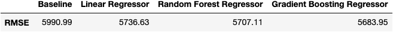
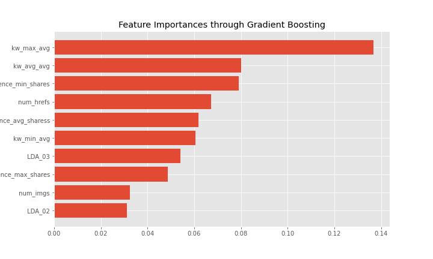

# Predicting Online News Popularity 
## Using features known before publication, can one predict how many shares an online article will have once published? 
The ability to predict popularity would be an invaluable tool in today's economy of online influence. Our newsfeeds are dictated by what algorithms think we want to see, but they are also dictated by what's popular amongst our own social networks. Being able to not only signify what features in an online news article are impactful for numbers of shares, but to also predict the number of shares would be influential in its own right. By using regression machine learning models, I attempt to do just that. 

## Data 
This dataset was donated to the UCI Machine Learning Repository and can be accessed [here](https://archive.ics.uci.edu/ml/datasets/Online+News+Popularity). It consists of data for about 39,000 news articles all scraped from the online news website [Mashable](https://mashable.com/). Additionally it includes the total number of shares across various social media platforms for each article. This dataset also contains features engineered by its compilers, whose published paper detailing data acquisition and feature meanings can be found [here](https://repositorium.sdum.uminho.pt/bitstream/1822/39169/1/main.pdf) and can also be found in the data folder of this repo. 

## EDA 
Upon data exploraton, I noticed quite a range of numbers of shares, from 1 to more than 800,000.

With a mean of about 3000, and a standard deviation of more than 11,000, I figured that there must be a number of outliers that I must address before trying to fit any regression models. Additionally, the vast majority of these articles had around 1000 shares. 

Of the total 39,644 articles, 58 had at least 100,000 shares. This accounts for only 0.15% of the dataset. Thus I decided to remove these outliers for the purpose of this 

## Modeling
To start, I began with a baseline model by prediting the total mean of shares for each article. With this baseline model, the Root Mean Square Error (RMSE) was 5990.99. This is the score I aim to beat. 

Next I fit a simple linear regression model, not expecting much of a performance improvement from the baseline. The high variability in the dataset suggests that there are various distributions within the dataset, which would making trying to fit a linear regressor problematic (due to the lack of a linear relationship). The RMSE for a linear regression model was 5736.63. 

I moved on to a Random Forest Regressor, using a GridSearchCV to find optimal hyperparameters. In doing so, my best model performed with an RMSE of 5707.11. I did another GridSearchCV to uncover optimal hyperparameters for a Gradient Boosting Regressor, and used these hyperparameters to fit a model that performed slightly better, with an RMSE of 5683.95.

## Feature Importances  
While these results are not optimal, we can still gain some insight through the model's feature importances. 

According to the model, these are the top ten most impactful features when predicting the numbers of shares. The top five feature names are 'kw_max_avg', 'kw_avg_avg', 'self_reference_min_shares', 'num_hrefs', 'self_reference_avg_shares'. The first two refer to the number of shares and keywords contained in the meta-data of the articles referenced by the articles for which we have in our actual dataset. 'Self_reference' refers to other Mashable.com articles referenced, and the shares these articles received. Lastly, 'num_hrefs' refers to the number of links shared in the article. Gained with this knowledge, those taking part in the online marketplace of news and information can set themselves up to be as popular as possible. 

## Future Exploration 

Since this dataset is so varied, with articles having 1-10 shares and some having more than 100,000, my next step is to employ clustering to uncover different categories of articles that might not be in line with topic categories. In doing so, we could produce classes of articles, and if we can do this well enough then we can accurately apply regression within these classes to have a better performing model in predicting the actual number of shares. 

